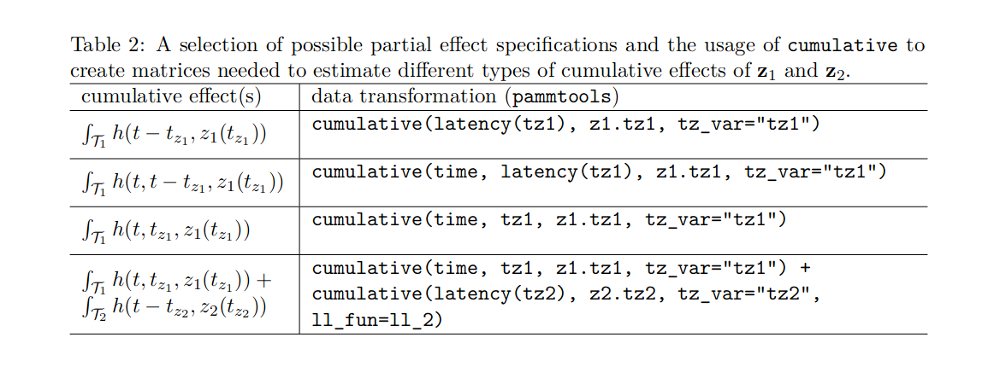
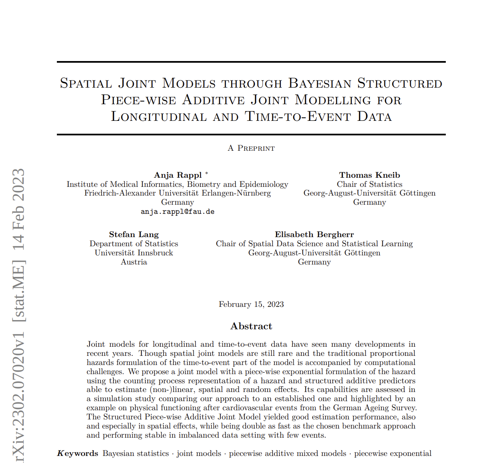

---
class: inverse, middle, center

.center[
.font150[
**Part V: Extensions and Outlook**
]
]

<html>
  

  

</html>

---
# Exposure-Lag-Response Associations

Much more generally, PAMMs/**pammtools** can also be used to fit delayed and time-limited, cumulative and time-varying effects of TDCs

We refer to these types of effects as *E*xposure-*L*ag *R*esponse *A*ssociations (ELRA). See `r Citet(bib, "bender_penalized_2019")` for details

.center[

<a href="https://academic.oup.com/biostatistics/article/20/2/315/4852816">
  <image src="figures/screenshot-elra-paper.png" height="400px">
</image>
</a>

]

---
# Exposure-Lag-Response Associations

**Inputs**:
- **Time of exposure** $t_z$: Time at which TDCs are observed
- **Exposure value** $z(t_z)$: The value of the TDC at exposure time $t_z$
- **Time-to-event** $t$: Follow-up time

--

**A general Exposure-Lag-Response Association (ELRA)** can be defined as

$$g(\mathbf{z}, t) = \int_{\mathcal{T}(t)} h(t, t_z, z(t_z))\mathrm{d}t_z$$

**Components**:

- **Partial effects $h(t,t_z,z(t_z))$**: The effect of the TDC recorded at
exposure time $t_z$ with value $z(t_z)$ on the hazard at follow up time $t$

--

- **Lag-lead window/Integration borders** $\mathcal{T}$: Defines the integration limits. 
Minimal requirement $\mathcal{T}(t) = \{t_{z}:t_{z}\leq t\}$

---
# Exposure-Lag-Response Associations (3)

**A general Exposure-Lag-Response Association (ELRA)** can be defined as

$$g(\mathbf{z}, t) = \int_{\mathcal{T}(t)} h(t, t_z, z(t_z))\mathrm{d}t_z$$

Special cases:

- Weighted cumulative exposure (WCE; `r Citet(bib, "Sylvestre2009")`):

$$g(\mathbf{z}, t) = \int_{\mathcal{T}(t)} h(t-t_z) z(t_z)\drm t_z$$

- Distributed-lag non-linear model (DLNM; `r Citet(bib, "Gasparrini2014", "Gasparrini2017",
max.names = 1)`):

$$g(\mathbf{z}, t) = \int_{\mathcal{T}(t)} h(t-t_z, z(t_z))\drm t_z$$

---
# Exposure-Lag-Response Associations (4)

All of these can again be conveniently estimated using PAMMs/GAMMs with appropriate (very complex) data pre-processing abstracted away by **`pammtools`** (see `r Citet(bib, "bender_pammtools_2018")`)

.center[

</img>

]

---
# Beyond (mgcv) GAMMs

Here we focused on GAMMs as backend for computation (which makes sense!), however, in some situation another backend might be advantageous, e.g.

- **`scam`**: GAMMs with monotonicity constraints
- **`brms`**: Fully Bayesian estimation of (hierarchical) GAMMs
- **`mboost`**: Boosting GAMMs for automated variable/term selection
- ...

Most of the functionality of **`pammtools`**, especially data trafo can be used as before

Some adjustments w.r.t. to post-processing might be necessary

---
# Beyond Statistical Modeling

In general, PEM based approaches not limited to statistical modeling (cf. `r Citet(bib, "bender.generalMl.2021")`)

.center[

]

---
# Beyond Statistical Modeling
For example gradient boosted trees (no adjustment to **`xgboost`** needed, only data trafo)

.column[&nbsp;&nbsp;&nbsp;&nbsp;&nbsp;&nbsp;&nbsp;&nbsp;&nbsp;&nbsp;&nbsp;&nbsp;&nbsp; Time-varying effects]
.column[&nbsp;&nbsp;&nbsp;&nbsp; Shared vs. cause-specific effects (in CR)]

.center[

]

---
# Deep Statistical Modeling

DeepPAMM `r Citep(bib, c("kopper_semistructured_2021", "kopper.deeppamm.2022"))`: NN-based extension of PAMMs based on *Semi-structured Distributional Regression* framework by David Rügamer

$$
    h(t|\mathbf{x}, \mathbf{z}_1, ...) = f(\mathbf{x}, t) + \gamma_1 d_1(\mathbf{z}_1) + \dots + \gamma_G d_G(\mathbf{z}_G),
$$

where $f(\mathbf{x}, t)$ is our standard (structured) PAMM predictor and
$d_1(\mathbf{z}_1),  ...$ are embedings learned from (deep) neural networks

Allows to specify standard survival model depending on tabular features (with stratified baseline hazards, TVE, etc.) + incorporate information from other modalities like image, text, etc.

---
# Back to Statistical Modeling

`r Citet(bib, "rappl.spatial.2023a")`

.center[

</img>

]

---
# The Future of PAMMs/pammtools

- currently working of refactoring data-transformation in order to support data transformation for multi-state modeling
  + some open bugs + PRs
  + more complex settings, e.g. CR or recurrent events with cumulative effects not well tested

- in the future: refactor backend for more seemless integration of other GAMM software (**`brms`**, **`mboost`**, etc. )

- lots of "under the hood work"

- contributions are welcome!
