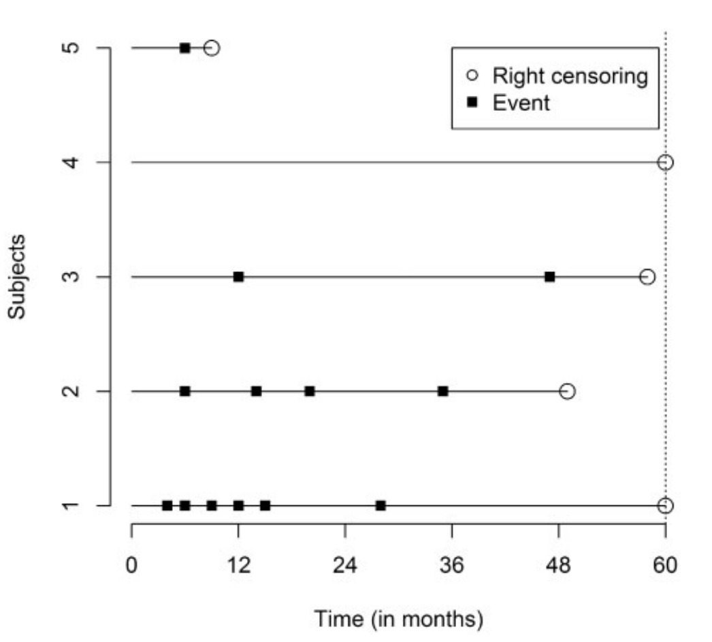

---
class: inverse, middle, center

.center[
.font120[
**Recurrent Events**
]
]

<html>
  <div style=---float:left></div>
  <hr color='#005500' size=1px width=900pxpx>
</html>

---
# Motivation
`r NoCite(bib, "cook_statistical_2007")`

- Study of processes which generate events repeatedly over time

- Such processes are refered to as *recurrent event processes*

- The data they generate is called *recurrent event data*

- The observations of the process ends with
  + end of study
  + censoring during the study
  + terminal (competing) event $\rightarrow$ multi-state model


---
# Examples

- Time to infection at point of catheter insertion in dialysis patients

- Incidence of Malaria in children

- Incidence of Pneumonia in young children `r Citep(bib, "ramjith_flexible_2021")`

- Episodes of illness in chronic diseases

- Occurence of tumors in rats exposed to carcinogenes

- Stoppage of assembly lines (e.g., due to machine failure)

- ...


---
# Schematic
An exemplary schematic of a reccurrent events data set for 5 subjects is shown below (source: `r Citet(bib, "amorim_modelling_2015")`)

.center[

]

- The choice of model for such data depends on
  - the assumptions about the dependency of the observations for one subject
  - the choice of time scale (which also depends on assumptions about the process)

---
# Timescale

### Gap timescale
- interest in the time between events
- time at which a subject enters risk set for $k$-th event ( $k>1$ ) is reset to 0
- also waiting time, "renewal process" or "clock-reset" approach


### Calendar timescale
- interest in the full course of the recurrent event process
- an individual's time starts when entering the study and stops when leaving the study/censoring
- also "total timescale" or "clock-forward" approach


---
# Timescale II
Consider the following example data
```{r}
data("cgd", package = "survival")
cgd |> filter(id %in% c(1,7)) |> select(id, age, tstart, tstop, status, enum) |>
  mutate(gap = tstop - tstart) |>
  knitr::kable()
```

- Gap time: All observations are at risk at $t=0$ at the same time
- Calendar time: Subjects are left-truncated w.r.t. to the $k$-th event at time $t_{k-1}$ for $k>1$
-  Analysis of *time until first event* equivalent to standard survival modeling (but potentially loss of power for estimation of covariate effects)
-  In RCTs, treatment might not have (significant) effect on time until first event but prolong time until subsequent events or reduce number of subsequent events


---
# Models following from different assumptions

Consider for now analysis on the *gap timescale*:
- Assumption I: complete independence of events on subject and past, all recurrences have same baseline hazard <br>
$\qquad \rightarrow$ standard survival modeling
- Assumption II: baseline hazard (potentially) different for different events <br>
$\qquad \rightarrow$ stratification w.r.t. to event number
- Assumption III: as Assumption I with intra-subject correlation<br>
$\qquad \rightarrow$ frailty model
- Assumption IV: Assumption II and Assumption III <br>
$\qquad \rightarrow$ frailty model with stratification w.r.t. event number
- Assumption V: Assumption IV + additional dependency on past <br>
$\qquad \rightarrow$ frailty model with stratification w.r.t. event number and further (time-dependent) covariates

For *calendar timescale*, we obtain the same models with additional consideration of left-truncation


---
# The frailty model
The hazard for subject $i$ and event number $k$ at time point $t$ is given by

$$\begin{equation}\label{eq:ag_model}
h_{ik}(t) = h(t|\bfx_i, \bfx_{ik}, {b}_{i})
    = h_0(t)\exp(\bfx_{i}^\top\bsbeta + \bfx_{ik}^\top\bsbeta_k + b_i),
\end{equation}$$

- $\bfx_{ik}$ are potentially event dependent covariates/interaction terms
- $\bsbeta$, $\bsbeta_k$ are the fixed coefficients
- $b_i \sim N(0, \sigma_b^2)$ are the random effects

Note that at estimation stage, $t$ is either
  - time since origin (calendar time scale) or
  - time since last event (gap time scale)

---
# The stratified frailty model
For the stratified frailty model `r Citep(bib, "boxsteffensmeier_repeated_2006")` the hazard for the $k$-th event is given by
$$\begin{equation}
h(t|\bfx_{i}, \bfx_{ik}, b_i)
    = h_{0k}(t)\exp(\bfx_{i}^\top\bsbeta + \bfx_{ik}^\top\bsbeta_k + b_{i})
\end{equation}$$

- ${h}_{0k}\left(.\right)\geq 0$ are different, unspecified baseline hazard functions for the $k=1,2,\ldots$ events

--

  - the $\bfx_{ik}^\top\bsbeta_k$ component is optional
  - covariates $\bfx_{ik}$ describe the past or event-specific effects
    + number of past events
    + total time under observation (before "current" event)
    + waiting time of the last event
    + interaction terms with event number $k$ or any of the above
  - $\bsbeta_k$ are event specific effects, e.g. when hazard depends on past or $\bfx_{ik}$ contains interaction terms of covariates with event number $k$
  - covariate effects can be extended to potentially non-linear, potentially time-varying relationships $f(x_i, x_{ik},t)$ $\rightarrow$ additive models


---
# Recurrent Events Analysis with PAMMs/**`pammtools`**
See `r Citet(bib, "ramjith.recurrent.2022")` for details

- Data transformation as usual with `as_ped` functions, however
  + Formula contains information about entry and exit times for risk sets of specific event number `Surv(start, stop, status)~.`
  + additional `transition` argument indicates the variable in the data that contains information on event number
  + additional `timescale` argument indicates whether data should be transformed to gap-time scale or calendar-time scale


---
# Example: Childhood malaria


See extra file `malaria-reccurrent-events.html`
