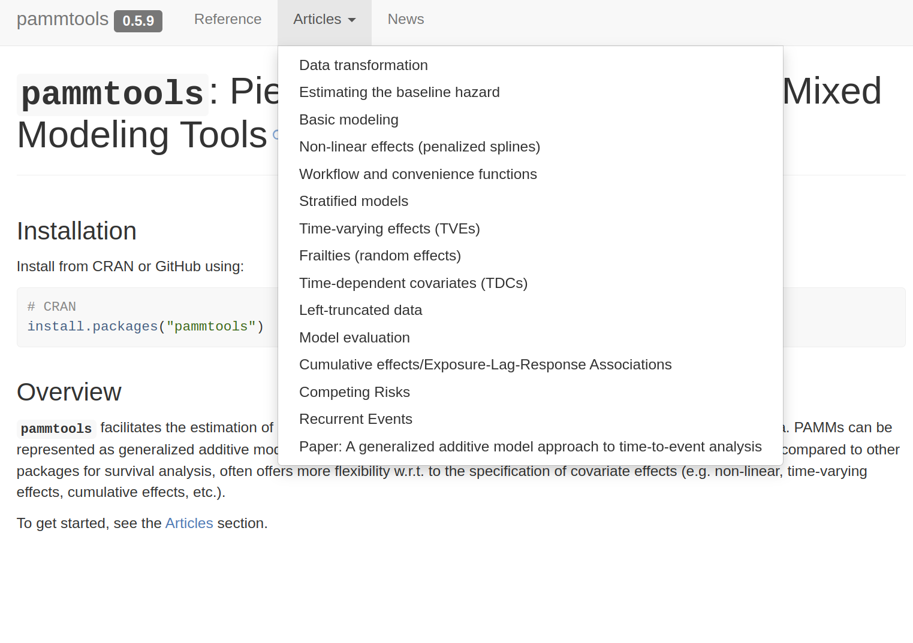
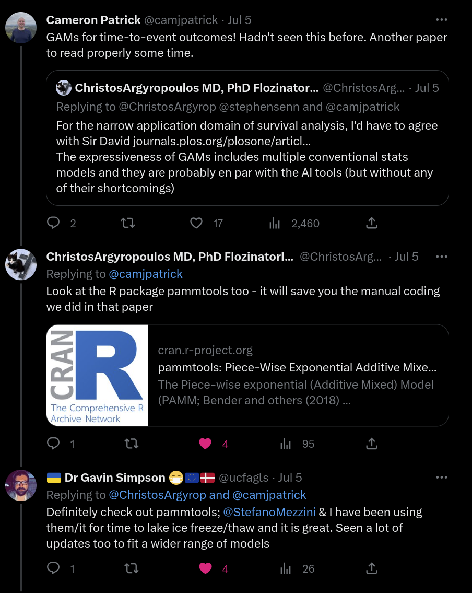

---
# TL;DR

- Using standardized data transformation we can transform many survival tasks to more standard (Poisson) regression tasks

- Doing so, allows you to use your favorite (non-survival) model/package for survival analysis (concretely: estimation of the hazard), e.g.
    - **`mgcv`**: flexible, multi-dimensional non-linear effects, penalized splines, spatial effects, random effects
    - **`gamm4`**: if you need more complex random effect structures
    - **`scam`**: if you need smooth effects with shape restrictions
    - ...

- This is very useful for practical survival analysis, but is cumbersome to do
  - appropriate data transformation depending on the survival task (right-censoring, left-truncation, competing risks, ...)
  - post-processing like calculating hazards, survival probabilities, transition probabilities, visualization

---
# TL;DR 2

- The **`pammtools`** package abstracts away all the cumbersome stuff so you can focus on exploring the relationships in your data

- We refer to this model class as **P**iece-wise exponential **A**dditive (**M**ixed) **M**odel (PA(M)M) (as we use Generalized Additive Mixed Models to estimate Piece-wise exponential Models)

- In this Framework, we model the (interval-specific) hazard and
  - time itself is just another covariate
  - time-varying effects are interactions of time with other covariates
  - time-dependent covariates are easily incorporated

- It is equivalent to the (extended) Cox model, but we obtain an explicit estimate of the baseline hazard and don't have to rely on Cox specific software for model estimation

- Today we illustrate how to use it in mostly relatively simple settings (showing equivalence to established survival analysis methods), but it really shines when you have complex (non-linear) covariate effects and interactions

---
# TL;DR 3

R package **`pammtools`** greatly facilitates work with PEMs/PAMMs, as it abtracts away all the fidly handling of data transformation and prediction

.pull-left[

]

.pull-right[

]

---
# Today's Agenda

1. Why is `pammtools` useful? - An overview of survival analysis results tackled in today's session
2. How can `pammtools` help me analyze survival data? - A quick overview to get from survival data to interpretable results
3. What exactly do I need to do to get results? - An insight into the nitty-gritty details of producing survival analysis results with `pammtools` in R  
3.1 Basic Scenarios: Baseline, Linear Effects, Non-Linear Effects  
3.2 Non-proportional hazards: time-dependent covariates, time-varying effects  
3.3 Event-History analysis: competing risks, multi-state scenario  
3. Summary and Outlook
